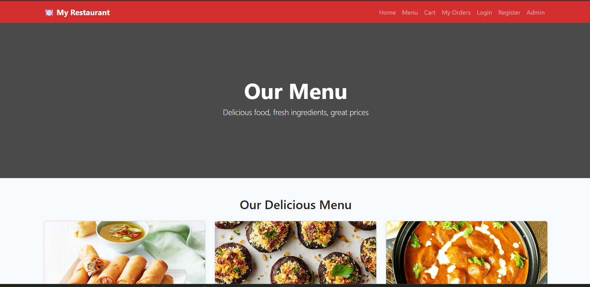
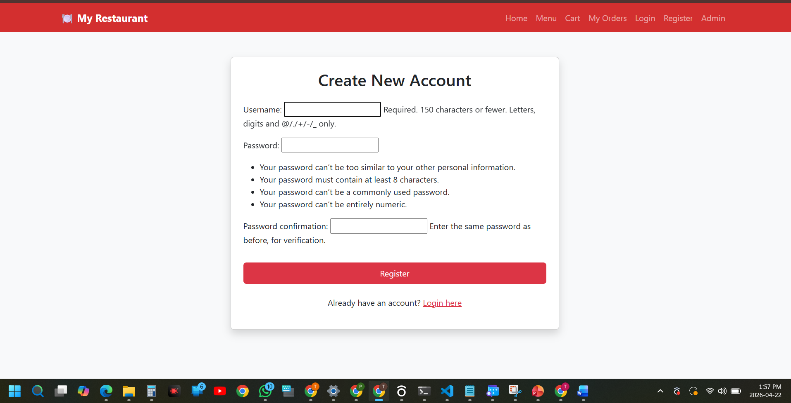
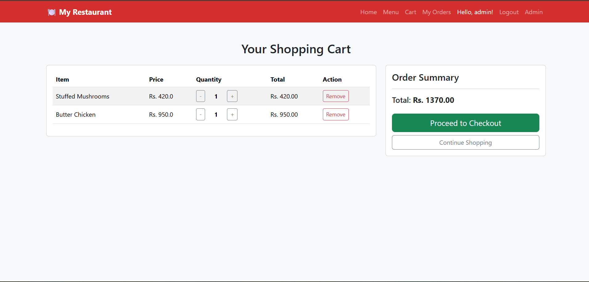
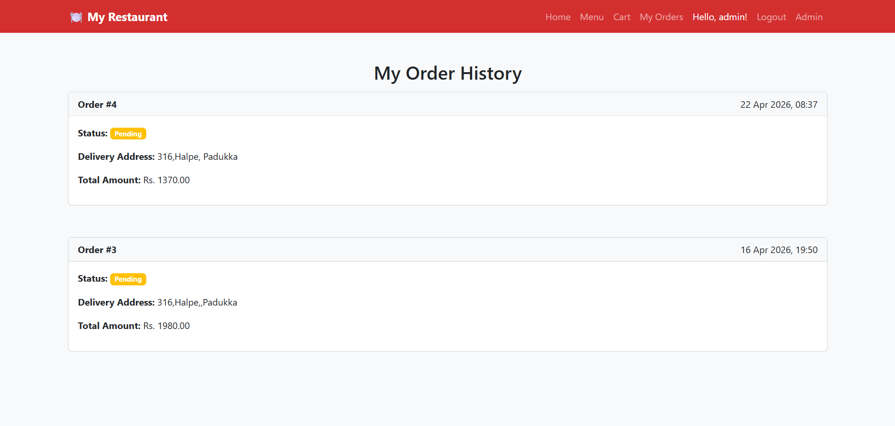
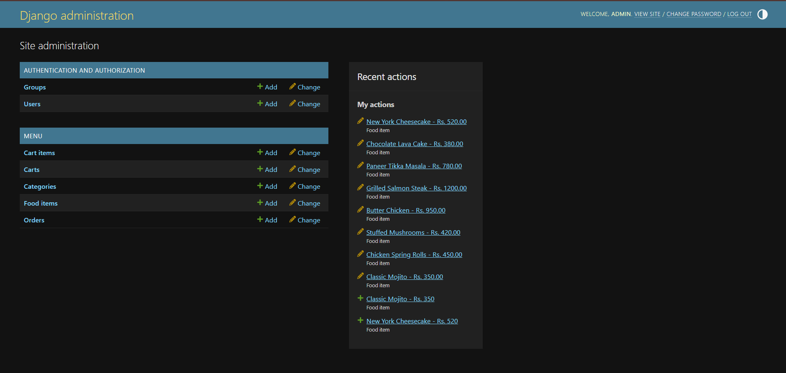

# Restaurant Ordering System
A Django-based web application that allows restaurants to list food items and customers to browse menus, add items to their cart, and place orders. Built with Django 6.0.4 and Bootstrap 5, this project demonstrates end-to-end functionality including authentication, cart management, and order history.

## Features
- User Authentication

- Register, login, and logout

- Dynamic navbar with personalized greetings

- Menu Management

- Food items with images, descriptions, prices, and categories

- Admin panel for adding, editing, and managing menu items

- Shopping Cart

- Add items to cart

- Update quantities (+/-)

- Remove items

- Clear cart option (optional enhancement)

- Automatic total calculation

- Order Processing

- Checkout with delivery address

- Orders saved to database with status tracking

- Order history view for customers

## Admin Panel

- Manage categories, food items, and orders

- Search, filter, and update order statuses

## UI & Design

- Responsive Bootstrap 5 layout

- Red theme with consistent styling

- Success/error notifications using Django messages framework

## Tech Stack
- Backend: Django 6.0.4

- Frontend: Bootstrap 5, CSS

- Database: SQLite (default, can be swapped for PostgreSQL/MySQL)

- Other Packages: Pillow (image handling), django-bootstrap5

## Screenshots

### Home Page

### Login Page

### Cart Page

### Order History

### Admin Panel

